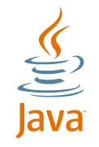

{: .photo}

{: .dl-horizontal}
Course:
: CIS 121---Spring 2016

Instructor:
: [Rajiv Gandhi](mailto:rajivg100@gmail.com)

Teaching Assistants:
: [Course staff](staff.html)

Discussion Forum:
: [Piazza](https://piazza.com/upenn/spring2016/cis121/)

Lectures:
: Tuesdays and Thursdays at 10:30am in Towne 100

Prerequisites:
: [CIS 120](http://www.seas.upenn.edu/~cis120/) and [CIS 160](http://www.thepigeonholeprinciple.com)

Textbook:
: [Introduction to Algorithms, 3rd edition](http://www.amazon.com/Introduction-Algorithms-3rd-Thomas-Cormen/dp/0262033844/).
The lectures and the reading will draw from the textbook. It is strongly
recommended that you buy this textbook. It is available from the Penn Bookstore,
as well as various online retailers.

---

{: .content}
Grading

: The grading for the course will consist of:

    * 35% for homework assignments and the final project
    * 17.5% for each of two midterm exams (2/18 and 4/7)
    * 25% for the final
    * 5% for recitation attendance. Recitation attendance is mandatory.

Late submission policy

: The following applies to all homeworks, both written and programming, except
    for the final project, which does not have a late day policy. Each student
    has two free, no-strings-attached "late days" in case of extenuating circumstances. 
    Homeworks can be submitted at most two days late provided that you have the requisite 
    number of late days.
    If you are out of late days, then you will not be able to submit your homework. One
    "day" is defined as anytime between 1 second and 24 hours after the homework
    deadline. Late written homeworks can be turned in to Laura Fox in
    Levine 308. The final project does not have the same late policy; it has its
    own late policy, which will be announced with its release.

Collaboration policy for written homeworks

: You are allowed to discuss solutions to problems in groups of three,
    *documenting* who you discussed with at the top of your assignment. You are
    allowed to ask anyone for LaTeX help (for instance, "How do I center a stack
    of equations?"). You are **not** allowed to write up the solutions together.
    You must do that by yourself.

Collaboration policy for programming homeworks

: You are allowed to discuss low-level issues like the meaning of Java
    constructs, or how to use the computing environment. You are allowed to
    discuss high-level questions such as what the instructor/lab TA said, the
    content of the textbook or other general resources. You **not** allowed
    to...

    -   Discuss issues directly pertaining to the homework questions or
        their solutions.
    -   See another students homework solutions.
    -   Show your solutions to another student.
        -   This includes asking a classmate to debug your code and agreeing
            to debug a classmate’s code. If you do this during office hours,
            know that the TAs are *required* to report your names to the
            instructor.
    -   Share any code except the code that is being made available by us on
        the course website to be used specifically with your solutions
        -   Occasionally, a *small* snippet of code *from the textbook* may help
            your work. You can use such a snippet *with attribution*, i.e.,
            provided you add a comment in which you make clear you copied it
            from the textbook.
        -   You may NOT use snippets of code from the Internet (e.g.,
            StackOverflow.com and similar).
        -   You may NOT share test cases.
    -   Post your code where it may be accessible to others. This is largely a
        clarification of the previous rule. This means that you may NOT seek
        help from online forums, like StackOverflow or similar. You may NOT push
        your code to a public repository like GitHub (private repositories,
        however, are permitted). You may seek help from online forums for
        low-level issues as mentioned above. When in doubt, ask on Piazza.
    -   Look at other people’s information.
        -   If you find a terminal on which somebody else has logged in and
            forgot to log out, you *must* log them out.
        -   When somebody else is typing a password in front of you *must*
            look out the window, or at your shoes, or at the picture of Brad
            Pitt or Angelina Jolie that you carry on your keychain.
    -   Use any code downloaded from the Internet or sent to you by email,
        Facebook, text, Twitter, or even scribbled notes passed from hand to
        hand. :)
    -   Share the material that we post for this course with anybody who is
        not a registered student in this course or a staff member.
        -   If you find any such material already posted somewhere else you
            *must* inform the course staff immediately. Same if you are
            contacted by people who offer to solve your homework for money,
            or who knows what else. Use your common sense and ask any member
            of the staff if you are not sure about a resource you are
            considering.
        -   You may NOT share course materials without the prior approval of the
            course staff. You may NOT post course materials on sites such as
            CourseHero. This infringes upon the copyright of materials authored by
            the course staff.

    Any violation of the collaboration policy will be dealt with severely.

Regrade policy for programming homeworks

: We allow you to indicate *small errors* (defined below) that you have made,
    which, when fixed, will allow your programs to pass autograder tests. You
    will need to send an email, by the regrade deadline, which is one week after
    you receive your scores, to
    [cis121-16sp-staff@googlegroups.com](mailto:cis121-16sp-staff@googlegroups.com).
    This email must identify exactly the error in your code and include a
    precise description of the fix that needs to be made. A *small error* is a
    problem whose fix should not require changing more than 1--2 lines of code.
    A TA will make the change and rerun the autograder tests, or you may attach
    the revised file and we will compare the submissions. Your new score will be
    the maximum of your original score and 80% of your regraded score. What are
    some acceptable/common types of "small" errors?

    - Use of `==` instead of `.equals`
    - Modification of a method header, causing compilation failure
    - Lack or addition of `!` operators

    Regrade emails to individual TAs are NOT guaranteed to be processed.

Regrade policy for written homeworks and exams

: Each written assignment and each midterm exam will have a regrade request
    deadline that will be posted typically one week after the assignment or exam
    has been returned with your score. Beyond that deadline, regrades can only
    be given by permission of the instructor. Regrade requests are meant for
    cases such as arithmetic mistakes in tabulating a final score, or for a
    grader not seeing that you continued your solution on the back of the page
    (as an example). In the interest of transparency, the course staff makes its
    best effort to indicate exactly where points are docked with the associated
    reasons. For the written assignments and for the midterms, solutions will be
    provided in class. Please consult these carefully before requesting a
    regrade. Please fill out the
    [regrade request form](content/hws/regrade_request_16sp.pdf) and bring it to
    the course administrator, Laura Fox, in Levine 308, together with the
    assignment or exam by the regrade deadline.
